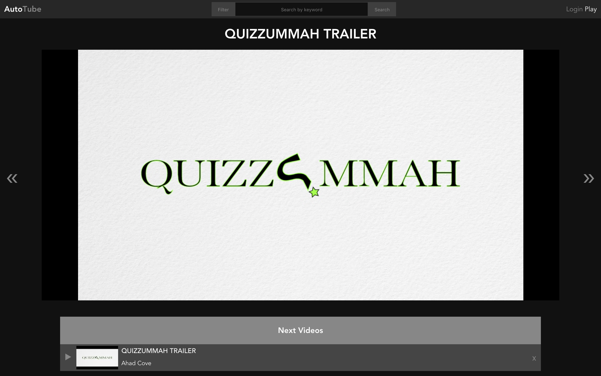
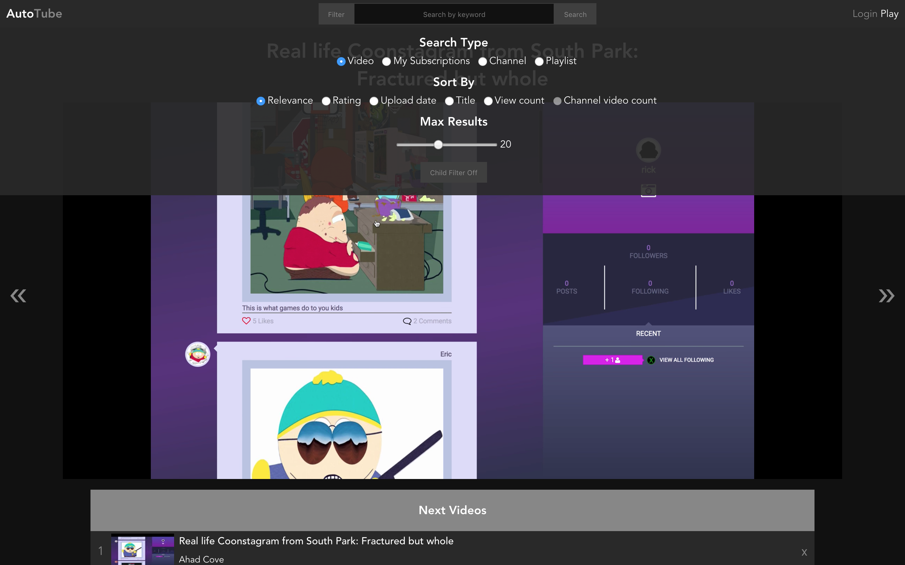

# AutoTube - The Missing Youtube Player

<p align="center">
    <a href="https://auto-tube.com" target="_blank">
      
    </a>
</p>

AutoTube is the all in one youtube player that you never knew you needed, developed by [Bilal Abdullah](https://bilalabdullah.me).

Ever wondered why youtube hasn't implemented certain features like being able to make a playlist of your subscriptions newest videos in a click of a button? Me too, that's why I created AutoTube. Spend less time making playlists and more on your work!

## [Live-Site](https://auto-tube.com)

<p align="center">
  <a href="https://auto-tube.com" target="_blank">
    
  </a>
</p>

## Why AutoTube?
If you're like me, you always have something playing in the background while programming.

This may sound familiar to you. A typical workday consist of pulling out the computer and finding a playlist or building your own to start running in the background while you work. You may start adding all of the new videos from your subscriptions or browse to find a topic that you want. 

I can testify that this takes a lot of time. This is where **AutoTube** steps in. Simply pulling down filter and clicking My Subscriptions will retrieve all of your subscriptions and getting the latest videos from each and making a playlist that starts playing automatically.
Leave it in the background and start your work day in a matter of seconds.

## Youtube almost ad free
There's nothing worse than getting on youtube and starting your videos and running into ads on literally every single video.
Listening to that same one ad and having to navigate back to the page to skip it is infuriating.
Using AutoTube will get rid of almost all of the ads that you would normally face. There are some videos that will bypass this and still display an ad, but it's only a few.

## Features

<p align="center">
    <a href="https://auto-tube.com" target="_blank">
      
    </a>
</p>

Open up **Filter** and you will be given a list of options to choose from:

### Search Type

<dl>
  <dt>Video:</dt>
  <dd>This is a simple search  that will make a playlist of what ever keyword you're searching for.</dd>
  <br />
  <dt>My Subscriptions:</dt>
  <dd>The bread and butter of AutoTube. <b>My Subscriptions</b> will create a playlist of all of your subscriptions newest videos in a matter of seconds.
  Currently it get's the 3 latest videos from your subscriptions</dd>
  <br />
  <dt>Channel:</dt>
  <dd>Search for a channels username and you will be given a list to pick from. After picking the list it will make a playlist from the channel taking into account of any other filters you have.</dd>
  <br />
  <dt>Playlist:</dt>
  <dd>Search for a playlists by keyword and you will be given a list to pick from. After picking the list it will start playing.</dd>
  <br />
</dl>

### Sort By
<dl>
  <dt>Relevance:</dt>
  <dd>Resources are sorted based on their relevance to the search query.</dd>
  <br />
  <dt>Rating:</dt>
  <dd>Resources are sorted in reverse chronological order based on the date they were created.</dd>
  <br />
  <dt>Title:</dt>
  <dd>Resources are sorted alphabetically by title.</dd>
  <br />
  <dt>View Count:</dt>
  <dd>Resources are sorted from highest to lowest number of views.</dd>
  <br />
  <dt>Channel Video Count:</dt>
  <dd>Only works with Channels. Channels are sorted in descending order of their number of uploaded videos.</dd>
  <br />
</dl>

### Max Results:
<dd>Determines how many videos you would like to retrieve.
For My Subscriptions it will only allow a maximum of 5 videos per channel.</dd>


### Child Filter:
<dd>Turning Child Filter on indicates will restrict the content that is returned.</dd>


## Developers only: Getting Api Key and Client Id

Mush have an API_KEY and CLIENT_ID inside env to use the app

## Build Setup

``` bash
# install dependencies
yarn install

# serve with hot reload at localhost:8080
yarn run dev

# build for production with minification
yarn run build

# build for production and view the bundle analyzer report
yarn run build --report
```

## Would you like to donate?
The goal of AutoTube was to remove any distractions, to maximize production and get on with your day.
In order to do this, any type of ads have been removed and any need to signup on the app etc.
The first page that comes to you starts playing a video immediately.
This comes at a cost though. Hosting on a server and using Youtube's Api cost money after so many users.
If you tend to use this app as your primary source of video watching and would like to help further the development of this app, donations would definitely help.
It would be greatly appreciated if you could donate to my [paypal.me](https://paypal.me/AhadCove)